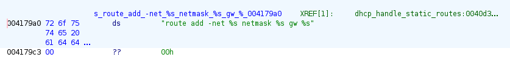

# Analyzing the Netgear EX6100

A few weeks ago, I purchased a Netgear EX6100 for $5 at a local garage sale. Score!

The device has reached end of life, and as such has not received any software updates since July, 2020 - uh oh!

I decided it likely wasn't smart to add it to my home network, so instead, it became a new toy for security research! :)

**Note:** This repository will likely be a continual work-in-progress, as this is something I'm only poking at in my free time. Feel free to reach out directly or open an issue if you have any questions or comments!

## Current TODO List

- Complete analysis of sbin/ contents
    - Complete analysis of acos_service binary
    - Complete analysis of bd binary
- Research device specs and architecture
- Disassemble device for hardware analysis/testing
- Have fun!

## Known Public CVEs

To check for known public CVEs, I used the NIST National Vulnerability Database's [CVE Search](https://nvd.nist.gov/vuln/search/results?isCpeNameSearch=false&query=ex6100&results_type=overview&form_type=Basic&search_type=all&startIndex=0).

In total, I found **41 CVEs** that affect the Netgear EX6100, stretching from 2017 to 2024. To make things easier to parse, I've split them out into a separate file, [EX6100_CVEs.md](EX6100_CVEs.md).

To provide some rough analysis, the CVSS 3.1 rating counts are as follows:

- 9 CRITICAL
- 9 HIGH
- 22 MEDIUM
- 1 LOW

(CVSS ratings are taken from the NIST National Vulnerability Database)

### Outdated Firmware Woes...

Being that the last firmware update available for this device is dated July 2020, it seems like the lastest firmware revision (1.0.2.28) is likely still vulnerable to **11 different CVEs** that were published **after** July 2020:

- CVE-2020-35796
    - Dated: 2020-12-29
    - CVSS 3.1 Score: **9.8 - CRITICAL**
- CVE-2020-35799
    - Dated: 2020-12-29
    - CVSS 3.1 Score: **9.8 - CRITICAL**
- CVE-2020-35800
    - Dated: 2020-12-29
    - CVSS 3.1 Score: **9.4 - CRITICAL**
- CVE-2021-38514
    - Dated: 2021-08-10
    - CVSS 3.1 Score: 2.4 - LOW
- CVE-2021-38527
    - Dated: 2021-08-10
    - CVSS 3.1 Score: **9.8 - CRITICAL**
- CVE-2021-45618
    - Dated: 2021-12-25
    - CVSS 3.1 Score: **9.8 - CRITICAL**
- CVE-2021-45619
    - Dated: 2021-12-25
    - CVSS 3.1 Score: **9.8 - CRITICAL**
- CVE-2021-45648
    - Dated: 2021-12-25
    - CVSS 3.1 Score: **7.5 - HIGH**
- CVE-2021-45658
    - Dated: 2021-12-25
    - CVSS 3.1 Score: **9.8 - CRITICAL**
- CVE-2022-24655
    - Dated: 2022-03-18
    - CVSS 3.1 Score: **7.8 - HIGH**
- CVE-2024-35519
    - Dated: 2024-10-14
    - CVSS 3.1 Score: **8.4 - HIGH**

## Sourcing Device Firmware

There are a number of firmware binaries available for the EX6100 on the [NETGEAR website](https://www.netgear.com/support/product/ex6100/#download):

- [1.0.2.28](https://www.downloads.netgear.com/files/GDC/EX6100/EX6100-V1.0.2.28_1.1.138.zip) (newest)
- [1.0.2.24](https://www.downloads.netgear.com/files/GDC/EX6100/EX6100-V1.0.2.24_1.1.134.zip)
- [1.0.2.18](https://www.downloads.netgear.com/files/GDC/EX6100/EX6100-V1.0.2.18_1.1.131.zip)
- [1.0.2.16](https://www.downloads.netgear.com/files/GDC/EX6100/EX6100-V1.0.2.16_1.1.130.zip)
- [1.0.2.6](https://www.downloads.netgear.com/files/GDC/EX6100/EX6100-V1.0.2.6_1.1.120.zip)
- [1.0.1.36](https://www.downloads.netgear.com/files/GDC/EX6100/EX6100-V1.0.1.36_1.0.114_07311820.zip)
- [1.0.0.28](https://www.downloads.netgear.com/files/GDC/EX6100/EX6100_V1.0.0.28_1.0.66.zip)
- [1.0.0.22](https://www.downloads.netgear.com/files/GDC/EX6100/EX6100_V1.0.0.22_1.0.51.zip) (initial release)

For this analysis I'll be focused on the newest available version, 1.0.2.28, released on 2020-07-29

## Firmware Analysis

Now then, analyzing the firmware: The firmware is delivered as a zip, so the first step was pretty basic:

```sh
unzip EX6100-V1.0.2.28_1.1.138.zip
```

This extracted two files:

- EX6100-V1.0.2.28_1.1.138.chk
    - This is the actual device firmware, in 'chk' format
- EX6100-V1.0.2.28_1.1.138_Release_Notes.html
    - This is a copy of the release notes as an HTML page

Now to focus on extraction!

## Extracting Netgear '.chk' firmware

Luckily, Netgear's '.chk' firmware format is well-understood at this point and can be extracted.

Previously, my go-to would be to use a combination of [binwalk and ubi-reader to extract the ubifs-root partition from the file](https://gist.github.com/nstarke/7d12de1d209d9c699dc0bbc481837848). However, this should no longer be necessary with binwalk v3!

Having built the latest binwalk v3 docker container, we get this tidy output:

```
$ sudo docker run -t -v.:/analysis binwalkv3 EX6100-V1.0.2.28_1.1.138.chk

                                                            /analysis/EX6100-V1.0.2.28_1.1.138.chk
--------------------------------------------------------------------------------------------------------------------------------------------------------------
DECIMAL                            HEXADECIMAL                        DESCRIPTION
--------------------------------------------------------------------------------------------------------------------------------------------------------------
0                                  0x0                                CHK firmware header, board ID: U12H248T00_NETGEAR, header size: 58 bytes, data size:
                                                                      5433533 bytes
58                                 0x3A                               uImage firmware image, header size: 64 bytes, data size: 5433469 bytes, compression:
                                                                      lzma, CPU: MIPS32, OS: Linux, image type: OS Kernel Image, load address: 0x80000000,
                                                                      entry point: 0x8000C310, creation time: 2020-07-13 08:29:20, image name: "Linux Kernel
                                                                      Image"
--------------------------------------------------------------------------------------------------------------------------------------------------------------

Analyzed 1 file for 106 file signatures (237 magic patterns) in 24.0 milliseconds
```

Immediately we can see the CHK firmware header, noting a board ID of 'U12H248T00_NETGEAR'. Without any other information, the fact that it's already picking up on a NETGEAR board ID seems like we're heading in the right direction!

Second, you can see it picked up on the uImage firmware image, showing a MIPS32-based Linux OS, compressed with lzma. Additionally, the creation time of 2020-07-13 is pretty close to our firmware release date of 2020-07-29 - it seems like binwalk is parsing everything correctly, no false positives here!

If we just tack the `-e` flag onto the previous binwalk command, it will dump all of the extracted files to the `./extractions/` folder.

```sh
sudo docker run -t -v.:/analysis binwalkv3 -e EX6100-V1.0.2.28_1.1.138.chk
ls extractions/

EX6100-V1.0.2.28_1.1.138.chk.extracted/
```

Now we're free to browse around our device's extracted filesystem.

## EX6100 Filesystem Tree

As an initial step, I generated a full 'tree' listing of the filesystem's structure, just to get a better idea of where everything is and what kind of files it has. This has been uploaded as the file [ex6100_fs_tree.txt](ex6100_fs_tree.txt).

## sbin Analysis

An interesting place to start is the /sbin folder. The directory listing is as follows:

```
total 560
drwxr-xr-x  2 root root   4096 Jul 13  2020 .
drwxrwxr-x 17 root root   4096 Jul 13  2020 ..
lrwxrwxrwx  1 root root     12 Jul 13  2020 acos_init -> acos_service
-rwxr-xr-x  1 root root 105040 Jul 13  2020 acos_service
-rw-rw-r--  1 root root    717 Jul 13  2020 affinity.sh
lrwxrwxrwx  1 root root     14 Jul 13  2020 arp -> ../bin/busybox
-rwxr-xr-x  1 root root  24716 Jul 13  2020 bd
lrwxrwxrwx  1 root root      2 Jul 13  2020 burn5gpass -> bd
lrwxrwxrwx  1 root root      2 Jul 13  2020 burn5gssid -> bd
lrwxrwxrwx  1 root root      2 Jul 13  2020 burn_hw_rev -> bd
lrwxrwxrwx  1 root root      2 Jul 13  2020 burnboardid -> bd
lrwxrwxrwx  1 root root      2 Jul 13  2020 burncode -> bd
lrwxrwxrwx  1 root root      2 Jul 13  2020 burnethermac -> bd
lrwxrwxrwx  1 root root      2 Jul 13  2020 burnpass -> bd
lrwxrwxrwx  1 root root      2 Jul 13  2020 burnpcbsn -> bd
lrwxrwxrwx  1 root root      2 Jul 13  2020 burnpin -> bd
lrwxrwxrwx  1 root root      2 Jul 13  2020 burnrf -> bd
lrwxrwxrwx  1 root root      2 Jul 13  2020 burnsku -> bd
lrwxrwxrwx  1 root root      2 Jul 13  2020 burnsn -> bd
lrwxrwxrwx  1 root root      2 Jul 13  2020 burnssid -> bd
-rwxrwxr-x  1 root root   3079 Jul 13  2020 config-powersave.sh
-rwxrwxr-x  1 root root  20910 Jul 13  2020 config-vlan.sh
-rwxr-xr-x  1 root root  10163 Jul 13  2020 config.sh
lrwxrwxrwx  1 root root      2 Jul 13  2020 getchksum -> bd
-rwxrwxr-x  1 root root   2320 Jul 13  2020 global.sh
-rw-rw-r--  1 root root   1034 Jul 13  2020 gtd.sh
-rw-rw-r--  1 root root    879 Jul 13  2020 gtp.sh
lrwxrwxrwx  1 root root     14 Jul 13  2020 halt -> ../bin/busybox
-rwxr-xr-x  1 root root   6092 Jul 13  2020 htmlget
lrwxrwxrwx  1 root root     14 Jul 13  2020 ifconfig -> ../bin/busybox
lrwxrwxrwx  1 root root     14 Jul 13  2020 init -> ../bin/busybox
lrwxrwxrwx  1 root root     14 Jul 13  2020 insmod -> ../bin/busybox
lrwxrwxrwx  1 root root     12 Jul 13  2020 ledamber -> acos_service
lrwxrwxrwx  1 root root     12 Jul 13  2020 leddown -> acos_service
lrwxrwxrwx  1 root root     12 Jul 13  2020 ledgreen -> acos_service
lrwxrwxrwx  1 root root     12 Jul 13  2020 ledup -> acos_service
lrwxrwxrwx  1 root root     14 Jul 13  2020 lsmod -> ../bin/busybox
lrwxrwxrwx  1 root root     14 Jul 13  2020 mdev -> ../bin/busybox
-rwxrwxr-x  1 root root   2325 Jul 13  2020 miniupnpd.sh
-rwxr-xr-x  1 root root  10676 Jul 13  2020 ntpclient
-rw-rw-r--  1 root root   1445 Jul 13  2020 pcie_enumerate_reboot.sh
lrwxrwxrwx  1 root root     14 Jul 13  2020 poweroff -> ../bin/busybox
-rwxr-xr-x  1 root root 278908 Jul 13  2020 pppd
-rwxrwxr-x  1 root root  15451 Jul 13  2020 ralink_config_init.sh
-rwxrwxr-x  1 root root   4340 Jul 13  2020 ralink_config_lan.sh
-rwxrwxr-x  1 root root  14408 Jul 13  2020 ralink_config_wlan.sh
-rwxrwxr-x  1 root root   1549 Jul 13  2020 ralink_fs_init.sh
-rwxrwxr-x  1 root root   2878 Jul 13  2020 ralink_miniupnpd.sh
lrwxrwxrwx  1 root root     12 Jul 13  2020 read_bd -> acos_service
lrwxrwxrwx  1 root root     14 Jul 13  2020 reboot -> ../bin/busybox
lrwxrwxrwx  1 root root      2 Jul 13  2020 reset_no_reboot -> bd
lrwxrwxrwx  1 root root      2 Jul 13  2020 resolve_domain -> bd
lrwxrwxrwx  1 root root      2 Jul 13  2020 restart_all_processes -> bd
lrwxrwxrwx  1 root root     12 Jul 13  2020 restore_bin -> acos_service
lrwxrwxrwx  1 root root     14 Jul 13  2020 rmmod -> ../bin/busybox
lrwxrwxrwx  1 root root     14 Jul 13  2020 route -> ../bin/busybox
lrwxrwxrwx  1 root root     12 Jul 13  2020 routerinfo -> acos_service
-rw-rw-r--  1 root root    250 Jul 13  2020 rps.sh
-rw-rw-r--  1 root root   3093 Jul 13  2020 sd_rw_test.sh
lrwxrwxrwx  1 root root      2 Jul 13  2020 showconfig -> bd
-rw-rw-r--  1 root root   1544 Jul 13  2020 smp.sh
lrwxrwxrwx  1 root root     12 Jul 13  2020 uptime -> acos_service
lrwxrwxrwx  1 root root     14 Jul 13  2020 vconfig -> ../bin/busybox
lrwxrwxrwx  1 root root     12 Jul 13  2020 version -> acos_service
```

If we strip away all of the symbolic links (Using `find . -mindepth 1 ! -type l`), the real directory structure looks a bit more like this:

```
acos_service
config-powersave.sh
ralink_miniupnpd.sh
config-vlan.sh
miniupnpd.sh
gtd.sh
ralink_fs_init.sh
ralink_config_init.sh
ralink_config_wlan.sh
config.sh
affinity.sh
sd_rw_test.sh
global.sh
gtp.sh
htmlget
ralink_config_lan.sh
smp.sh
ntpclient
pppd
bd
pcie_enumerate_reboot.sh
rps.sh
```

Much easier to parse! We'll go through one-by-one and take a peek at each of these.

### acos_service Analysis

`acos_service:ELF 32-bit LSB executable, MIPS, MIPS-II version 1 (SYSV), dynamically linked, interpreter /lib/ld-uClibc.so.0, stripped`

`acos_service` is responsible for a few different symlinked commands:

- acos_init
- acos_service (duh)
- ledamber
- leddown
- ledgreen
- ledup
- read_bd
- restore_bin
- routerinfo
- uptime
- version

These commands give us some hints to the service's use - control of LEDs, uptime/version/router information, 'read_bd' and 'restore_bin', as well as an initialization routine.

#### acos_service Strings

I ran the `strings` command on `acos_service` to see if there was anything juicy. The full output is stored in [strings-acos_service.txt](strings-acos_service.txt) for your viewing pleasure.

Some interesting strings of note:

```
product_description
ambit_product_description
AC750 Wireless Dual Band Repeater EX6100
Release version : %s
                  %s/%s/%s
1.1.138
U12H268T00
V1.0.2.28
Jul 13 2020
16:27:01
           Time : %s %s
cfe_version
    CFE version : N/A
    CFE version : %s
/tmp/uboot.info
Boot code version
Boot code version : %c%s
cannot open file
wan_hwaddr_sel
wan_hwaddr
board_id
WSC_UUID
WSC/UUID
0x%s
WSC UUID: %s
Reading board data...
%02X:%02X:%02X:%02X:%02X:%02X
lan_hwaddr
et0macaddr
et1macaddr
ipv6ready
wan_hwaddr2
```

This section is interesting! It seems like some portions of the data are hard-coded for the current version release (such as the July 13 2020 release date), while others seem to be fetched dynamically (like the 'WSC UUID').

```
====== RPT to AP =====
by Michael, 2011.03.09
======================
```

Interesting! Not sure what this functionality is yet, but the presence of *any* software from 2011 is always interesting.

```sh
echo 2400 > /proc/sys/net/ipv4/neigh/br0/base_reachable_time
echo 2400 > /proc/sys/net/ipv4/neigh/default/base_reachable_time
echo 1 > /proc/sys/net/ipv4/conf/all/arp_filter
echo 1 > /proc/sys/net/ipv4/conf/all/accept_source_route
restart_all_processes
echo 1 >/proc/sys/net/ipv4/ip_forward
/bin/mknod -m 755 /dev/acos_nat_cli c 100 0
/sbin/insmod acos_nat
rm -rf /tmp/udhcpd.leases
route del -net %s netmask %s
route add -net %s netmask %s gw %s
echo 'nameserver %s' >> /tmp/resolv.conf
```

Uh oh, seeing shell commands embedded in a binary should be immediate cause for concern! This makes me assume they're using calls to `system()` within this binary to run shell commands. If we come across any instances that accept user input, this could be an immediate path to OS Command Injection - something that this router has systemically suffered from, according to its CVE history...

(As a side note, many routers and networking devices use `system()` calls or shell scripts for a surprising portion of device functionality - it's always worth looking around for command injection vulnerabilities!)

```
usage: rc [start|stop|restart|start_ripd|stop_ripd]
echo 'nameserver %s' >> /tmp/resolv.conf

```

#### acos_service Command Injection?

As stated in our strings analysis, the presence of shell commands in the acos_service binary immediately made me want to dig for `system()` calls.

I fired up Ghidra, importing the targeted binary as `MIPS:LE:32:default`. I also pointed Ghidra to the `/lib/` and `/usr/lib/` directories in the firmware's squashfs-root, with instructions to search the directories for any required shared libraries. With these settings, I was able to import `acos_service` for analysis without issue!

##### Analyzing dhcp_handle_static_routes()

I ran Ghidra's default analyzers on the binary, and decided to boil down our previous string search results to a single interesting entry:

```sh
route add -net %s netmask %s gw %s
```

This was where I'll start my command injection investigation. Before performing any in-depth research, this command is a juicy target for a few reasons:

1. The route command is a known BusyBox/Linux utility, meaning this is likely a true shell command and not some configuration file entry.
2. The parameters passed to the route command (the net, netmask, and gateway) do not have any quotes or obvious escaping present in the command, increasing the likelihood of command injection payloads working.
3. The network, netmask, and gateway parameters seem like values that could *probably* be changed by an end user from the router's web interface

So, lets dig for it! Using Ghidra's string search, I found it located at `0x004179a0`:



We can see there is one XREF to it, from the function `dhcp_handle_static_routes()`, which starts at `0x0040d15c`. A snippet of this function with our relevant command can be seen below:


Sure enough, they're assembling the command and throwing it right into `system()`!

Now, there are a few issues here:
1. If we look upwards in the program, our data comes from a hard-coded address of `0x0045a320` - we currently don't know what resides there, or what it's structure is
2. The data is checked to not be equal to zero - could potentially disrupt some attacks?
3. The data is all run through `inet_ntoa()` before being passed to the `system()` command.

Now, number 3 - what is `inet_ntoa()` and why could it be problematic?

The manual page for the function can be [read here](https://linux.die.net/man/3/inet_ntoa), or in the snippet below:

> The inet_ntoa() function converts the Internet host address in, given in network byte order, to a string in IPv4 dotted-decimal notation. The string is returned in a statically allocated buffer, which subsequent calls will overwrite.

Uh oh! We don't want our command injection payloads to be turned into IPv4 addresses...

To test a few payloads against `inet_ntoa()` and get a better idea of how it works, I borrowed a bit of code from the previously-linked manpage and created the following:

```c
#define _BSD_SOURCE
#include <arpa/inet.h>
#include <stdio.h>
#include <stdlib.h>

int main(int argc, char *argv[])
{
    struct in_addr addr;
    char input[50];
    
    scanf("%[^\n]%*c", input);

   if (inet_aton(input, &addr) == 0) {
        fprintf(stderr, "Invalid address\n");
        exit(EXIT_FAILURE);
    }

   printf("%s\n", inet_ntoa(addr));
    exit(EXIT_SUCCESS);
}
```

(It takes input from stdin so that you can play with it in an [online compiler](https://onecompiler.com/c/43n4dazd3)! I've also included the source over in [demos/inet_ntoa.c](demos/inet_ntoa.c))

Playing with this tiny example bin, we can start to get an idea of how our payloads may be ruined by this function:

- Input: 1234
    - Output: 0.0.4.210
- Input: 0
    - Output: 0.0.0.0
- Input: 1234567890
    - Output: 73.150.2.210
- Input: echo
    - Output: Invalid address
- Input: a
    - Output: Invalid address

So.. essentially no string input, or any malicious input at all! This wasn't an intentional security control, but it makes exploitation of a command injection issue basically impossible.

That being said, there is a somewhat interesting bug in this code! Check out the following decompilation:

```c
if (((*piVar11 != 0) && (piVar11[1] != 0)) && (piVar11[2] != 0)) {
    pcVar2 = inet_ntoa((in_addr)*piVar11); // net value
    strcpy(acStack_1b0,pcVar2);
    pcVar2 = inet_ntoa((in_addr)piVar11[1]); // netmask value
    strcpy(acStack_198,pcVar2);
    pcVar2 = inet_ntoa((in_addr)piVar11[2]); // gw value
    strcpy(acStack_180,pcVar2);
    if (param_1 == 0) {
        sprintf(local_a8,"route del -net %s netmask %s",acStack_1b0,acStack_198);
    }
// --- snipped for brevity --- //
```

Our input values are checked to ensure they are not equal to zero before the `inet_ntoa()` call. However, the *output* of these function calls is never checked... So if you were to pass a string like 'a' as any of the three input values, `inet_ntoa()` would return `0` and the value of `pcVar2` wouldn't actually be updated!

When you combine this with the three-in-a-row usage of `inet_ntoa()`, you can end up with some pretty unexpected behavior that doesn't actually throw an error.

For example, consider the following input:

- net: 1.1.1.1
- netmask: 2.2.2.2
- gateway: 3.3.3.3

As these are all valid input, they will be passed to the `route add` command as follows:

```sh
route add -net 1.1.1.1 netmask 2.2.2.2 gw 3.3.3.3
```

But now, consider that we swap out the middle value for 'a':

- net: 1.1.1.1
- netmask: a
- gateway: 3.3.3.3

This isn't a valid input for `inet_ntoa()` - but what happens? The value of `pcVar2` is never updated, leading to the following output:

```sh
route add -net 1.1.1.1 netmask 1.1.1.1 gw 3.3.3.3
```

The 1.1.1.1 value from the `net` value is never cleared out of `pcVar2`, and the value of `pcVar2` isn't updated due to the erroneous value of `netmask`, meaning our `net` value is unintentionally set as the `netmask` as well!

I couldn't think of any interesting ways to exploit this issue in this context, but I thought it was a pretty funky/interesting issue nonetheless. (I also made a new demo C binary to test this with - you can check it out at [demos/inet_ntoa_noerrorchk.c][demos/inet_ntoa_noerrorchk.c], or on the [online compiler](https://onecompiler.com/c/43n4dhynk))

### bd Analysis

TODO!

## Completed Research Tasks

Just to keep track of what I've already completed, I'll throw each step into a bullet point below.

- Research public CVEs
- Download firmware for static analysis